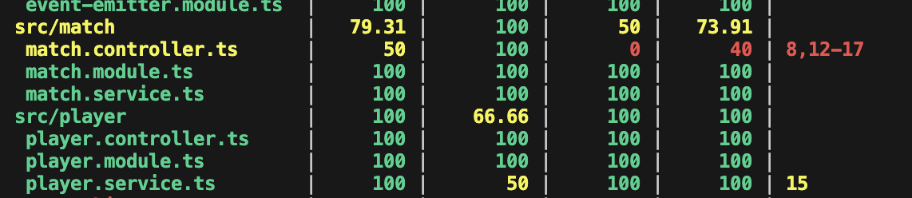

# Realtime Elo Ranker

Realtime Elo Ranker est une application web permettant de simuler des matchs entre des joueurs et de calculer et afficher leur classement Elo en temps réel.

# Installation

Il est important de lancer le serveur avant de lancer le client. Le lancement s'execute à la racine du projet.

## Installer les dépendances

```bash
pnpm install
```

## Lancer le serveur 

```bash
pnpm run apps:server:start:dev
```

## Lancer l'application cliente

Lancer l'application :

```bash
pnpm run apps:client:dev
```

## Lancer la doc swagger

```bash
pnpm run docs:swagger:start
```


## Lancer le mock de l'API

```bash
pnpm run apps:api-mock:start
```

# Pour les test : 

## Test unitaire et d'intégration

Il m'a fallu un peu de temps pour comprendre comment lancer les tests unitaires et d'intégration. Voici comment j'ai procédé :

j'ai installé @nestjs/testing avec jest et ts-jest pour les tests unitaires et d'intégration.

```bash
pnpm add -D jest @nestjs/testing ts-jest @types/jest
```
Pour essayer de lancer les tests unitaires se deplacer dans le serveur.

```bash
cd apps/realtime-elo-ranker-server
```

### Voir le coverage général des test 
```bash
pnpm test --coverage
```

### Voir l'execution des test pour un fichier en particulier
```bash
pnpm jest player.controller.spec.ts
```

Pour ma part j'ai voulu mettre en place quelques test nottament pour les parties du serveur qui sont les plus importantes. J'ai donc testé les controllers et les services pour match et player.

ce qui me donne ce resultat de coverage : 



## Test E2E

Pour les tests E2E, j'ai utilisé supertest pour tester les routes de l'API. J'ai créé un fichier de test e2e pour player

```bash
import { Test, TestingModule } from '@nestjs/testing';
import request from 'supertest';
import { INestApplication } from '@nestjs/common';
import { PlayerModule } from '../src/player/player.module';
import { PlayerService } from '../src/player/player.service';

describe('PlayerController (e2e)', () => {
  let app: INestApplication;
  let playerService = { addPlayer: jest.fn(), getPlayers: jest.fn() };

  beforeAll(async () => {
    const moduleFixture: TestingModule = await Test.createTestingModule({
      imports: [PlayerModule],
    })
      .overrideProvider(PlayerService)
      .useValue(playerService)
      .compile();

    app = moduleFixture.createNestApplication();
    await app.init();
  });

  it('/api/player (POST) should add a player', () => {
    const playerData = { id: '1', rank: 1500 };
    playerService.addPlayer.mockReturnValue(playerData);

    return request(app.getHttpServer())
      .post('/api/player')
      .send(playerData)
      .expect(201)
      .expect({
        message: 'Player created',
        data: playerData,
      });
  });

  it('/api/player (POST) should return a message when player already exists', () => {
    const playerData = { id: '1', rank: 1500 };
    playerService.addPlayer.mockReturnValue(null);

    return request(app.getHttpServer())
      .post('/api/player')
      .send(playerData)
      .expect(200)
      .expect({
        message: 'Player already exists',
      });
  });

  afterAll(async () => {
    await app.close();
  });
});
```

Cela représente un test e2e pour le controller player. Je n'ai pas passé plus de temps sur les tests car j'estime avoir compris comment cela fonctionnait et que j'ai pu mettre en place quelques tests pour les parties les plus importantes de l'application et que la suite serait juste des répétitions.


# Oragnisation du projet : 

## Serveur

Nous avons du crée un serveur pour remplacer l'API Mock , pour cela j'aieffectuer cette commande :

```bash
pnpm nest new apps/realtime-elo-ranker-server --skip-git -l TS --strict --package-manager pnpm
```

à partir de là j'ai pu commencer à implémenter les différentes parties du serveur.

Pour les controllers,modules,services j'ai utilisé les commandes suivante pour les générer :

```bash
pnpm nest generate service player
pnpm nest generate service ranking
pnpm nest generate service match

pnpm nest generate controller player
pnpm nest generate controller ranking
pnpm nest generate controller match


pnpm nest generate module player
pnpm nest generate module ranking
pnpm nest generate module match
```

à partir de là j'ai pu commencer à implémenter les différentes parties du serveur. J'ai simplement eu a utiliser la logique qui nous etait donnée dans le swagger de l'API pour les différentes routes.

# Event Emitter

L'Event Emitter est utilisé pour publier des événements en temps réel, notamment pour informer les clients connectés des mises à jour du classement des joueurs. pour cela j'ai utilisé le module `eventemitter2` pour gérer les événements.

## Mise en place

### Module Event Emitter

j'ai créé un module `EventEmitterModule` pour encapsuler la logique de l'Event Emitter. Ce module fournit le service `EventEmitterService` qui sera utilisé pour émettre des événements.

```typescript
import { Module } from '@nestjs/common';
import { EventEmitterService } from '../event-emitter/event-emitter-service';

@Module({
  providers: [EventEmitterService],
  exports: [EventEmitterService],
})
export class EventEmitterModule {}
```

### Service Event Emitter

Le service EventEmitterService encapsule l'instance de `EventEmitter2` et fournit une méthode pour émettre des événements de mise à jour du classement.

```typescript
import { Injectable } from '@nestjs/common';
import { EventEmitter2 } from 'eventemitter2';

@Injectable()
export class EventEmitterService {
  constructor(private readonly eventEmitter: EventEmitter2) {}

  emitRankingUpdate(player: any) {
    this.eventEmitter.emit('ranking.update', player);
  }

  getEmitter(): EventEmitter2 {
    return this.eventEmitter;
  }
}
```


### Utilisation dans l'application
Pour utiliser l'Event Emitter dans l'application, nous avons injecté le `EventEmitterService` dans les services et contrôleurs concernés. Par exemple, après la mise à jour du classement d'un joueur, nous émettons un événement de mise à jour lors de l'ajout d'un joueur.

```typescript
import { Injectable } from '@nestjs/common';
import { EventEmitterService } from '../event-emitter/event-emitter-service';

export interface Player {
    id: string;
    rank: number;
}

@Injectable()
export class PlayerService {
    constructor(private readonly eventEmitter: EventEmitterService) {}
    private players: Player[] = [];
  playerUpdates: any;

    addPlayer(id: string, rank: number = 1000) {
        const existingPlayer = this.players.find((p) => p.id === id);
        if (!existingPlayer) {
            const player = { id, rank };
            this.players.push(player);
            this.eventEmitter.getEmitter().emit('ranking.update', player); // EVENT EMITTER
            return player;
        }
        return null;
    }
```

Cette approche permet de notifier les clients en temps réel des changements de classement, améliorant ainsi l'expérience utilisateur.


# Stocker des données d'une requête à l'autre sans utiliser de base de données

Actuellement le serveur utilise du cache pour stocker les données des joueurs et des matchs. Cela permet de stocker les données en mémoire entre les requêtes sans avoir besoin d'une base de données. 

Cela veut aussi dire que les données sont perdues à chaque redémarrage du serveur.

Je n'ai malheuresement pas pu mettre en place une base de données pour stocker les données des joueurs et des matchs.
Ayant essayé de mettre en place une base de données avec TypeORM, j'ai rencontré des problèmes de configuration et de compatibilité avec ma machine , j'ai demandé de l'aide de nombreuses fois à mes collègue à M.Arsouze ou bien même à M.Faurie mais nous n'avons pas reussi à résoudre le problème. 

C'est pour cela que j'ai décidé de continuer avec le cache pour stocker les données des joueurs et des matchs.

Même si l'implementation de la base de donnée semble très accessible avec NestJS.

Avec la creation d'un player.entity.ts

comme on peut le voir dans mon arborescence de fichier j'ai bien un dossier entity qui contient un fichier player.entity.ts mais je n'ai pas pu aller plus loins car j'etais bloqué dans le AppModule pour ajouter TypeOrmforRoot.

# LENI CHABILAN


# Architecture

## Back for Front

Le serveur de l'application est un serveur BFF (Back for Front) qui expose une API Web pour gérer les fonctionnalités métiers de l'application. Il devra être basé sur NestJS, un framework Node.js pour construire des applications serveur.

Le code serveur est à implémenter dans le dossier `apps/realtime-elo-ranker-server`.

## Frontend

Le client de l'application est une application web basée sur Next.js, un framework React pour construire des applications web. Il servira une interface utilisateur pour saisir les résultats des matchs et afficher le classement des joueurs.

Le client devra communiquer avec le serveur via l'API Web pour gérer les fonctionnalités métiers de l'application.

Le classement, une fois restitué dans son état initial par le serveur, sera mis à jour en temps réel sur l'interface utilisateur du client.

Le code client est fourni dans le dossier `apps/realtime-elo-ranker-client`.

## API

L'API Web du serveur devra exposer les fonctionnalités telles que décrites dans le [swagger](#lancer-la-doc-swagger) fourni.

### Mock de l'API

Un [mock de l'API](#lancer-le-mock-de-lapi) est fourni pour tester le client sans avoir à implémenter le serveur. Le mock de l'API répondra aux requêtes du client avec des messages prédéfinis. Il ne gère pas les mises à jour en temps réel du classement.

# Règles de gestion

## Joueurs

- Un joueur est identifié par un ID unique (entité).
- Un joueur a un classement Elo qui est mis à jour après chaque match (objet valeur).
- Un joueur peut participer à des matchs contre d'autres joueurs.
- Un joueur peut être créé avec un classement initial.
  - Le classement initial par défaut est égal à la moyenne du classement de tous les joueurs existants.

## Matchs

- Un match est une confrontation entre deux joueurs.
- Un match a un résultat (victoire, défaite ou égalité).
- Le résultat du match est utilisé pour mettre à jour le classement des joueurs.
- Le classement des joueurs est mis à jour en suivant les fonctions de calcul du classement Elo.

## Classement

- Le classement Elo est un système de classement des joueurs basé sur le calcul de la probabilité de victoire de chaque joueur en fonction de leur classement respectif.
- Le classement est une valeur numérique qui représente le niveau de compétence d'un joueur et symbolise un ordre de classement relatif entre les joueurs et un "budget" de points semblable à une monnaie d'échange.

# Guide d'implémentation

## Serveur

Le serveur de l'application devra être implémenté en utilisant NestJS, un framework Node.js pour construire des applications serveur. Le serveur devra exposer une API Web pour gérer les fonctionnalités métiers de l'application.

## Structures de données

Les données des joueurs et des matchs devront être stockées en mémoire dans des structures de données appropriées.

- Les joueurs devront être stockés dans une liste ou un tableau avec leur score
- L'historique des matchs devra être stocké dans une liste ou un tableau.
- Les 

## Calcul du classement

Le calcul du classement Elo devra être implémenté en suivant les règles mathématiques décrites dans la section [Classement Elo](#classement-elo).

- Le classement des joueurs devra être mis à jour après chaque match en fonction du résultat du match et de l'écart de classement entre les joueurs.
- Le serveur devra, à la demande, servir un état actuel du classement des joueurs.
- Le serveur devra publier des événements en temps réel pour informer les clients connectés des mises à jour du classement.

## Conseils

*Ces conseils sont donnés à titre indicatif et ne sont pas exhaustifs. Les suivre n'est pas obligatoire mais peut vous aider à construire une application de qualité.*

- Utilisez la POO pour modéliser les structures de données.
- Utilisez la PF (Programmation Fonctionnelle) pour les diverses fonctions de calcul de résultats, les créations d'objets et les .manipulations de données primitives
- Utilisez les services pour encapsuler la logique métier.
- Utilisez les contrôleurs pour gérer les requêtes HTTP.
- Utilisez les Websockets ou les Server-Sent Events pour la mise à jour en temps réel du classement.
- Utilisez les tests unitaires pour valider les fonctions critiques métiers.
- Utilisez les tests d'intégration pour valider les interactions entre les composants.

# Annexes

## Classement Elo

Le classement Elo est un système de classement des joueurs dans un jeu à deux joueurs. Il est basé sur le calcul de la probabilité de victoire de chaque joueur en fonction de leur classement respectif. Le classement est mis à jour après chaque match en fonction du résultat du match et de l'écart de classement entre les joueurs.

Ce système est typiquement utilisé dans les jeux d'échecs, mais peut être adapté à d'autres jeux à deux joueurs.

### Calcul du classement

Le classement Elo est calculé en fonction du classement actuel des joueurs et du résultat du match. Le calcul est basé sur la formule suivante :

```
Rn = Ro + K * (W - We)
```

Avec :
- `Rn` : Nouveau classement du joueur
- `Ro` : Ancien classement du joueur
- `K` : Coefficient de pondération (facteur de sensibilité du classement)
- `W` : Résultat du match (1 pour une victoire, 0.5 pour une égalité, 0 pour une défaite)
- `We` : Probabilité de victoire du joueur en fonction de son classement et du classement de son adversaire

Exemple de calcul du classement de deux joueurs après un match :

```
# Joueur vainqueur
# Ro = 1200 # Ancien classement
# K = 32 # Coefficient de pondération
# W = 1 # Victoire
# We = 0.76 # Probabilité de victoire

Rn = 1200 + 32 * (1 - 0.76)
Rn = 1200 + 32 * 0.24
Rn = 1200 + 7.68
Rn = 1207.68
Rn ≈ 1208

# Joueur perdant
# Ro = 800 # Ancien classement
# K = 32 # Coefficient de pondération
# W = 0 # Défaite
# We = 0.24 # Probabilité de victoire

Rn = 800 + 32 * (0 - 0.24)
Rn = 800 + 32 * -0.24
Rn = 800 - 7.68
Rn = 792.32
Rn ≈ 792
```

Remarque : Le classement est arrondi à l'entier le plus proche. Le coefficient de pondération `K` est arbitraire et peut être ajusté pour augmenter ou diminuer la sensibilité du classement aux résultats des matchs.

### Probabilité de victoire

La probabilité de victoire `We` est calculée en fonction de la différence de classement entre les deux joueurs. Plus la différence de classement est grande, plus la probabilité de victoire du joueur le mieux classé est élevée.

Le calcul de la probabilité de victoire est basé sur la formule suivante :

```
We = 1 / (1 + 10^((Rh - Rl) / 400))
```

Avec :
- `Rh` : Classement du joueur le mieux classé
- `Rl` : Classement du joueur le moins bien classé

Exemple de calcul de la probabilité de victoire d'un joueur avec un classement de 1200 contre un joueur avec un classement de 800 :

```
# Joueur le mieux classé
# Ro = 1200 # Classement du joueur
# Rn = 800 # Classement de l'adversaire

WHe = 1 / (1 + 10^((1200 - 800) / 400))
WHe = 1 / (1 + 10^(400 / 400))
WHe = 1 / (1 + 10^1)
WHe = 1 / (1 + 10)
WHe = 1 / 11
WHe ≈ 0.09

# Joueur le moins bien classé
# Ro = 800 # Classement du joueur
# Rn = 1200 # Classement de l'adversaire

WLe = 1 / (1 + 10^((800 - 1200) / 400))
WLe = 1 / (1 + 10^(-400 / 400))
WLe = 1 / (1 + 10^-1)
WLe = 1 / (1 + 0.1)
WLe = 1 / 1.1
WLe ≈ 0.91

# Ou plus simplement
WLe = 1 - WHe
```

Remarques : 
- La probabilité de victoire est arrondie à deux décimales. Plus la différence de classement est grande, plus la probabilité de victoire est proche de 0 ou 1.
- La formule de calcul de la probabilité de victoire est basée sur la formule de la fonction logistique, qui est couramment utilisée pour modéliser des phénomènes binaires (victoire/défaite, succès/échec, etc.).
- La constante `400` est un paramètre empirique qui détermine la sensibilité de la probabilité de victoire à la différence de classement. Plus la constante est grande, plus la probabilité de victoire change rapidement avec la différence de classement.
- Par sa conception, le système Elo est mathématiquement un système transactionnel, c'est-à-dire que la somme des classements des joueurs reste constante après chaque match. Cela signifie que le classement gagné par un joueur est équivalent au classement perdu par son adversaire.
